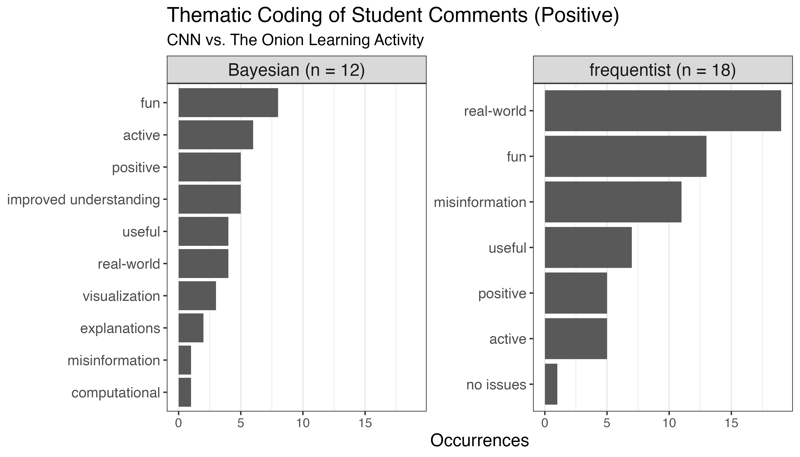
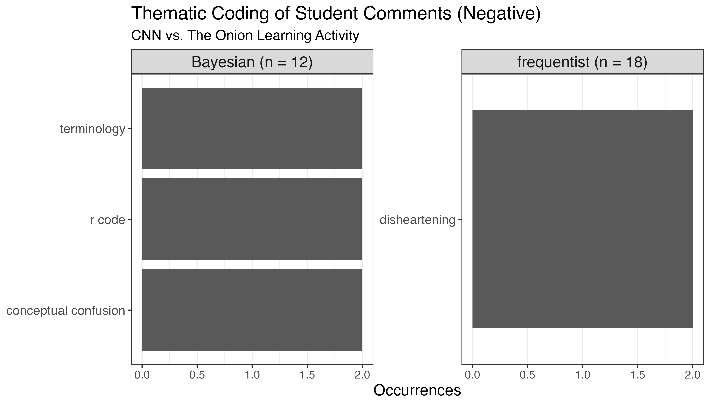
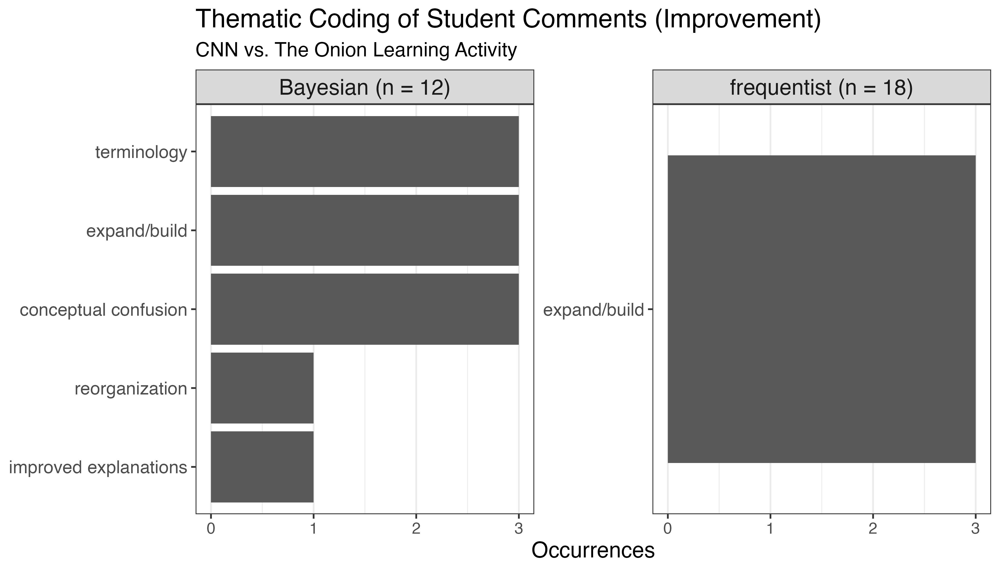

```{r echo = FALSE}
library(tidyverse)
library(gridExtra)
library(bayesrules)
```

## Outline

-   Introduce the Motivation and Course Context
-   Introduce the Bayesian Activity
-   Student Feedback

## Motivation

-   GAISE 2016: develop statistical thinking, with a particular focus on using **real data**.
-   **Student-generated data**: contribute to a classroom community and foster a more intuitive understanding of statistical analysis (Kuiper 2015).
-   **Coding** enables students to construct, modify, and replicate analyses (Chance 2007).

## Course Context

- Students to use the quiz data to evaluate a central claim: *how skilled is a person at distinguishing real news headlines from satirical headlines?*

- **Frequentist:** framed as a hypothesis test. Compares student performance against random guessing. 
- **Bayesian:** frames as process of updating beliefs with evidence (student, peer, and class quiz scores) to refine a prior understanding of a person's ability.
-   **Target Course:** Intro Statistics (F), Probability (B) or Bayesian Statistics Course (B)

\*Bayesian activity - we recommend prior R coding experience and familiarity with conditional probability

## Bayesian Learning Objectives

-   Define and distinguish between **prior** and **posterior** distributions.
-   Use the **Beta distribution** to construct prior beliefs about a probability.
-   Apply **Bayesian updating** to revise beliefs with observed data.
-   Interpret summary statistics (mean, mode, standard deviation) of Beta distributions.
-   Reflect on how prior information and data interact to shape posterior conclusions.

## Real vs. fake headlines

{fig-alt="Front page of Onion Newspaper: Headline reads Wikipedia Celebrates 750 Years of American Independence" width="1080"}CNN (the Cable News Network) is widely considered a reputable news source. The Onion, on the other hand, is (according to Wikipedia) “an American news satire organization".

How well do people distinguish real news headlines published on [cnn.com](cnn.com) from fake news headlines published on [theonion.com](theonion.com)?

## Bayesian Activity Sequence

1.  Introduce our Prior
2.  Construct and Visualize Priors
3.  Discuss Vague vs. Informative Priors
4.  Take the Quiz
5.  Update Priors with Data and Visualize Posterior
6.  Update Priors with Class Data and Visualize Posterior
7.  Compare Posteriors from Different Priors
8.  Discussion questions

## 1. Introduce priors

Let $\pi$ be the proportion of correct answers a person guesses right in the CNN vs the Onion quiz.

| Optimistic  | Undecided  | Pessimistic |
|-------------|------------|-------------|
| Beta(14, 1) | Beta(1, 1) | Beta(5, 10) |

```{r echo = FALSE, fig.align='center', fig.height=7.5, fig.width=17}

optimistic <- plot_beta(14, 1) +
  labs(title = "Optimistic")

undecided <- plot_beta(1, 1) +
  labs(title = "Undecided")

pessimistic <- plot_beta(5, 10) +
  labs(title = "Pessimistic")

gridExtra::grid.arrange(optimistic, undecided, pessimistic, ncol = 3)
```

## 2. Constructing priors

The shape parameters $\alpha$ and $\beta$ can be interpreted as the approximate number of successes and failures.

`Beta(approx_num_correct, approx_num_wrong)`.

```{r}

student_prior <- plot_beta(alpha = 8, beta = 7) +
  labs(title = "Student Prior")

student_prior
```

## 3. Discuss vague vs. informative priors

```{r}

vague <- plot_beta(alpha = 2, beta = 2) +
  labs(title = "Vague: alpha = 2, beta = 2")

informative <- plot_beta(alpha = 100, beta = 100) +
  labs(title = "Vague: alpha = 100, beta = 100")

gridExtra::grid.arrange(vague, informative, ncol = 2)
```

## 4. Take the quiz (15 CNN/Onion headlines)

Counselors Quarantine Homesick Campers\
A. CNN  B. The Onion

Man Makes Guillotine, Uses It\
A. CNN  B. The Onion

God Responds to Legislator's Lawsuit\
A. CNN  B. The Onion

Fan's Wife Allows Batmobile, But Has Limits\
A. CNN  B. The Onion

[Link to full Google Form](https://docs.google.com/forms/d/e/1FAIpQLSeNADV2SfZbCNZRcwZ_2oaP1eBh8rgXKV_WKxXyQR-5QGEBlA/viewform)

## 4. Take the quiz (15 CNN/Onion headlines)

Counselors Quarantine Homesick Campers\
A. CNN  **B. The Onion**

Man Makes Guillotine, Uses It\
**A. CNN**  B. The Onion

God Responds to Legislator's Lawsuit\
**A. CNN**  B. The Onion

Fan's Wife Allows Batmobile, But Has Limits\
**A. CNN**  B. The Onion

[Link to full Google Form](https://docs.google.com/forms/d/e/1FAIpQLSeNADV2SfZbCNZRcwZ_2oaP1eBh8rgXKV_WKxXyQR-5QGEBlA/viewform)

## 5. Update with data

`summarize_beta_binomial(alpha, beta, y = successes, n = trials)` summarizes the mean, mode, and variance of the prior and posterior Beta models of $\pi$

`plot_beta_binomial(alpha, beta, y = successes, n = trials)` plots prior pdf, scaled likelihood function, and posterior pdf

Arguments:

```         
-   `alpha, beta`: positive shape parameters of the prior Beta model
-   `y`: number of successes
-   `n`: number of trials
```

## 5. Update with data

```{r echo = TRUE}
summarize_beta_binomial(alpha = 8, beta = 7, y = 10, n = 15)

plot_beta_binomial(alpha = 8, beta = 7, y = 10, n = 15)   + 
  labs(title = "Student Prior")
```

## 5. Update with data

| Optimistic  | Undecided  | Pessimistic | Student Prior |
|-------------|------------|-------------|---------------|
| Beta(14, 1) | Beta(1, 1) | Beta(5, 10) | Beta(8, 7)    |

```{r echo = TRUE}
optimistic_prior <- plot_beta_binomial(alpha = 14, beta = 1, y = 10, n = 15) + 
  labs(title = "Optimistic")
undecided_prior <- plot_beta_binomial(alpha = 1, beta = 1, y = 10, n = 15) + 
  labs(title = "Undecided")
pessimistic_prior <- plot_beta_binomial(alpha = 5, beta = 10, y = 10, n = 15) + 
  labs(title = "Pessimistic")
student_prior <- plot_beta_binomial(alpha = 8, beta = 7, y = 10, n = 15)  + 
  labs(title = "Student Prior")
```

## 5. Update with data

```{r echo = FALSE}
gridExtra::grid.arrange(optimistic_prior, undecided_prior, pessimistic_prior, student_prior, ncol = 2)
```

## 6. Update with neighbor & class data

With class data: 80 correct out of 150 questions

| Optimistic  | Undecided  | Pessimistic | Student Prior |
|-------------|------------|-------------|---------------|
| Beta(14, 1) | Beta(1, 1) | Beta(5, 10) | Beta(8, 7)    |

```{r echo = TRUE}
optimist <- plot_beta_binomial(alpha = 14, beta = 1, y = 80, n = 150) + 
  labs(title = "Optimistic")
undecided <- plot_beta_binomial(alpha = 1, beta = 1, y = 80, n = 150) + 
  labs(title = "Undecided")
pessimist <- plot_beta_binomial(alpha = 5, beta = 10, y = 80, n = 150) + 
  labs(title = "Pessimistic")
student_prior <- plot_beta_binomial(alpha = 8, beta = 7, y = 80, n = 150) + 
  labs(title = "Student Prior")
```

## 7. Compare effects of prior choice on the posterior

```{r echo = FALSE}
gridExtra::grid.arrange(optimist, undecided, pessimist, student_prior, ncol = 2)
```

## 8. Discussion Questions

-   How does observing more data affect the shape of the posterior?

-   What happens to the posterior mean as you observe more correct or incorrect outcomes?

-   In what ways does the posterior reflect a compromise between prior belief and observed data?

## Frequentist activity

-   How many headlines do you expect to guess correctly out of 15?
-   How does this compare to the strategy of guessing randomly?

## Feedback Survey

1.  What aspects of this activity have impacted your learning positively?
2.  What aspects of this activity have impacted your learning negatively?
3.  What is your overall opinion of this activity?
4.  Do you have any recommendations on how this activity can be improved for future students?

## Survey Coding

Part 1: Responses classified as positive, negative, neutral or suggesting improvement.

Part 2: Coded using deductive and inductive subthemes.

## Survey Results - Positive

```{r}
#| label: fig-pos
#| echo: false
#| fig-align: center
#| out-width: "4.5in"
#| fig-alt: "Thematic coding of positive student comments broken down by Bayesian and frequentist versions of the activity."


```

## Survey Results - Positive

- "It was interesting and engaging.  Cool to use data we understand and have more of a stake in to learn new concepts" (F)
- "I think the use of the quiz as a concrete example was very helpful in understanding the complicated topics of posterior and prior probability. I enjoyed the coding aspect and felt it helped me visualize what was happening." (B)
- "Very fun, informative. Learning by doing / seeing is optimal."

## Survey Results - Negative

```{r}
#| label: fig-neg
#| echo: false
#| fig-align: center
#| out-width: "4.5in"
#| fig-alt: "Thematic coding of negative student comments broken down by Bayesian and frequentist versions of the activity."


```

## Survey Results - Negative

"I found the R component confusing"

"I would have liked to spend more time discussing the terms used in this lesson like likelihood, evidence, etc."

## Survey Results - Improvements

```{r}
#| label: fig-improv
#| echo: false
#| fig-align: center
#| fig-alt: "Thematic coding of student comments related to improvements broken down by Bayesian and frequentist versions of the activity."
#| out-width: "4.5in"


```

## Conclusions

- Overall, students found it a fun activity where they were able to generate their own data.
- More code scaffolding and revisiting explanations would improve the activity.

## Where to find the Activity

```{=html}
<iframe width="780" height="500" src="https://bayes-bats.github.io/tier2-short-term/course-materials/labs/beta_binomial_cnn_vs_onion/cnn_vs_onion_beta_binomial.html" title="CNN vs The Onion - Bayesian Thinking Activity"></iframe>
```

[Activity Link](https://bayes-bats.github.io/tier2-short-term/course-materials/labs/beta_binomial_cnn_vs_onion/cnn_vs_onion_beta_binomial.html); [Instructor Guide](https://bayes-bats.github.io/tier2-short-term/course-materials/labs/beta_binomial_cnn_vs_onion/cnn_vs_onion_facilitator.html); [Github Readme Homepage Link](https://bayes-bats.github.io/tier2-short-term/)

## Thanks and Questions

{fig-alt="Onion Headline: Baseball Statisticians Unveil New Analytics Model Measuring Precise Amount of Joy They Suck From The Game"}

This work was supported by the National Science Foundation under Grant Nos #2215879, #2215920, and #2215709.
